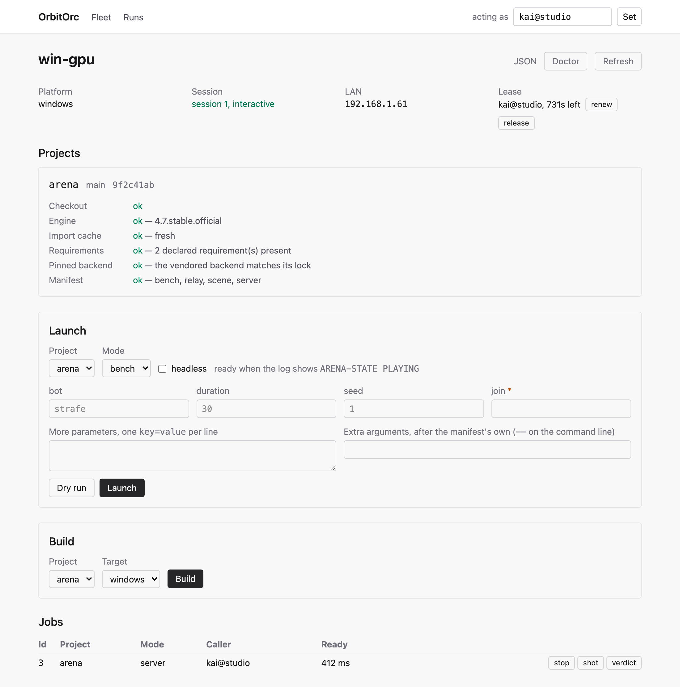
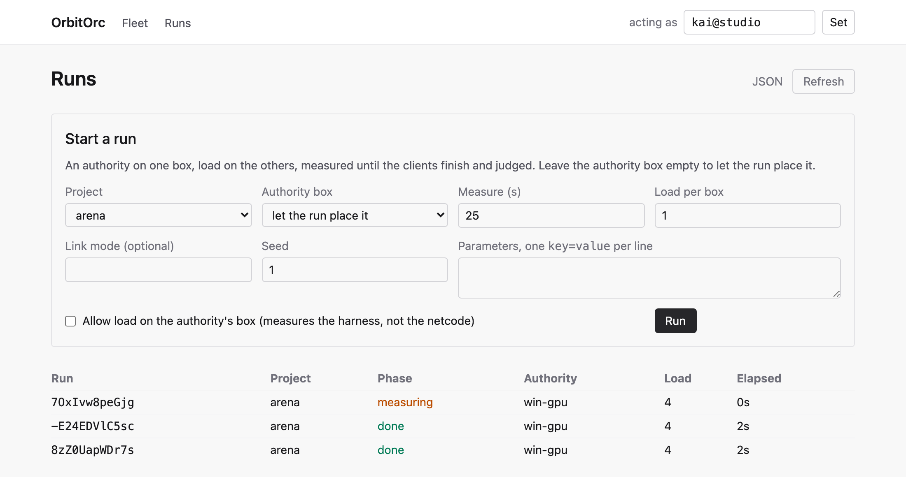
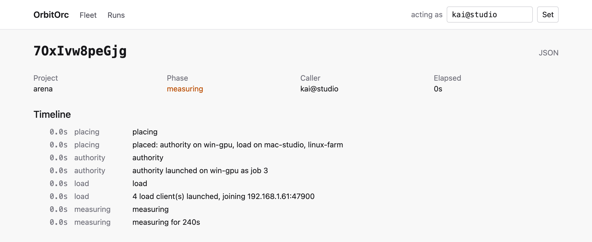

# The dashboard

Every verb the command line has, from a browser: `mix phx.server` and open `http://localhost:4000`.

## The name it acts as

The command line names its caller on every request (`--caller`, else `$USER@hostname`). A browser has
no such name, so the dashboard keeps one in the session: set it once in the header ("acting as"), and
every mutating verb a page runs carries it. While it is unset, the mutating buttons are closed and the
page says why — the same rule the API applies to an anonymous mutation. Reads never need it.

The lease arbitrates between names: a box leased to `fraz@Mac` refuses a launch from `tester`, in the
browser exactly as on the command line, and the browser can only renew or release a lease it holds.

## The pages

| Page | What it shows | What it does |
| --- | --- | --- |
| `/` | Every connected box, its agent version, its projects' revisions and problems; whether the fleet is on one revision | `sync` (every box or one, to a revision, with the agreement); `doctor` (a fresh report, which the fleet learns); `upgrade` (every agent or one, to a release) |
| `/box/:name` | The box's report, check by check; its lease; its jobs | `lease` claim/renew/release; `launch` and `dry-run` from a form built from the box's manifest (modes, each mode's parameters with defaults, headless, extra arguments); `build`; per job: `stop`, `shot`, `verdict` |
| `/box/:name/job/:id` | A job's log — the tail on entry, then every line as the box writes it | `logs` (tail and grep), `stop`, `shot` (the capture is shown on the page), `verdict`, `pull` (as a browser download) |
| `/runs` | Every run, in flight first | `run`: a form for the project, the authority box, the window, load per box, link mode, seed, parameters |
| `/run/:id` | A run's timeline and verdicts, as it happens | — |

Every page links the JSON the API answers for the same thing.

## Parity, enforced

`OrbitorcWeb.Verbs` is the one table of verbs. The JSON API's one controller action and every page call
the same function per verb, and a test asserts that every verb in the table is routed in the API and
bound to a page, and that the command line's usage names it. A verb added to one side cannot quietly
miss the others.

What the pages have that the command line does not by itself is a live view: a log page updates as
the box writes, a run page as the run publishes. `orbitorc logs --follow` closes the first gap over the
API's event stream (`GET /api/box/:box/jobs/:id/logs/stream`); `orbitorc run --wait` the second.
